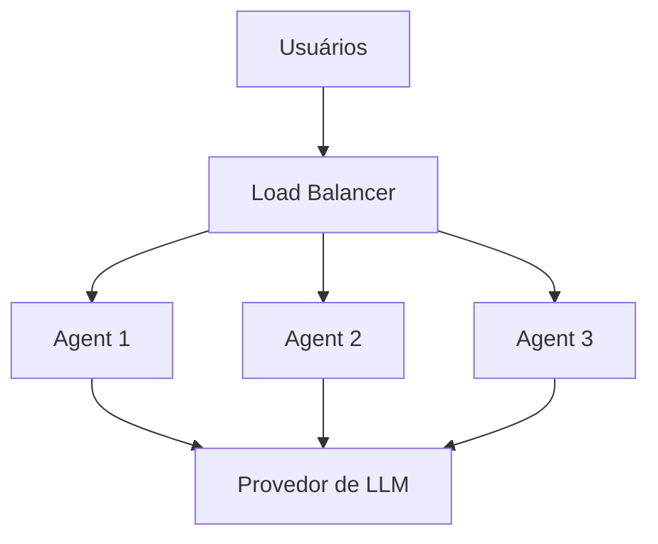

# Auto-scaling de agentes (conceitual)

> Esta página explica a ideia. Nada aqui foi executado no laboratório: não há Kubernetes nesta aula.



## Conceitos

| Conceito | O que é | Analogia |
| --- | --- | --- |
| Escala horizontal | Rodar **mais cópias** do agente, em vez de uma máquina maior. | Abrir mais caixas no supermercado. |
| Load balancer | Distribui os pedidos entre as cópias. | O funcionário que aponta a fila mais curta. |
| Health check | Pergunta periódica "você está bem?". O balanceador só envia pedidos a quem responde que sim. Dois tipos: *liveness* (está vivo?) e *readiness* (está pronto para atender?). | O caixa com a luz acesa. |
| Fila (queue) | Os pedidos esperam a vez em vez de falhar. Suaviza picos, ao custo de espera. | A senha da fila do banco. |
| Rate limit | Limite de pedidos por usuário e por tempo. Protege o custo e o provedor, que também tem limite de tokens por minuto. | A catraca que libera uma pessoa por vez. |
| Backpressure | Quando o sistema está cheio, ele **avisa quem envia para desacelerar** (resposta 429 ou 503) em vez de aceitar tudo e travar. | O aviso "lotado, volte mais tarde". |

## O que muda para agentes de IA

- O gargalo de um agente quase nunca é a CPU: é a **espera pelo provedor de LLM** (segundos por chamada) e o limite de tokens por minuto. Escalar só por CPU engana.
- Para escalar cópias, o que precisa lembrar (sessões, memória, aprovações humanas pendentes) deve ficar **fora do processo** (banco ou Redis). Nosso exemplo guarda o cadastro em memória: serve para a aula, não para várias cópias.
- Mais cópias significam mais chamadas ao provedor: o rate limit precisa ser **global**, não por cópia.

## Quando escalar: o que as métricas poderiam disparar

| Gatilho | Métrica | Observação |
| --- | --- | --- |
| CPU acima de 70% | métrica padrão do contêiner (não está no nosso `/metrics`) | Simples, mas pouco útil para agentes. |
| Requisições por segundo acima do limite | `sum(rate(agent_requests_total[1m]))` | Mede a demanda. |
| Latência p95 acima do limite | `histogram_quantile(0.95, sum(rate(agent_request_duration_seconds_bucket[5m])) by (le))` | Mede o que o usuário sente. |
| Requisições em andamento por cópia | um *gauge* que ainda não criamos | Costuma ser o melhor sinal para agentes. |

## Docker, Kubernetes e HPA

- **Docker**: Empacota o agente em uma imagem. Com o Compose dá para subir várias cópias (`docker compose up --scale agente=3`), mas a escolha de quantas é manual. Seria preciso um balanceador na frente.
- **Kubernetes**: Roda as cópias (*pods*) de um **Deployment**, expõe um **Service** (o balanceador) e usa *probes* como health check.
- **HPA (Horizontal Pod Autoscaler)**: Regra do Kubernetes que aumenta ou diminui o número de cópias conforme uma métrica. CPU funciona de fábrica; requisições por segundo e p95 exigem levar as métricas do Prometheus ao Kubernetes (Prometheus Adapter ou KEDA).

```yaml
# EXEMPLO CONCEITUAL: não foi executado neste laboratório.
apiVersion: autoscaling/v2
kind: HorizontalPodAutoscaler
metadata:
  name: agente
spec:
  scaleTargetRef:
    apiVersion: apps/v1
    kind: Deployment
    name: agente
  minReplicas: 2
  maxReplicas: 10
  metrics:
    - type: Resource
      resource:
        name: cpu
        target:
          type: Utilization
          averageUtilization: 70
    # Com o Prometheus Adapter ou o KEDA, também seria possível usar requisições por segundo ou o p95.
```
